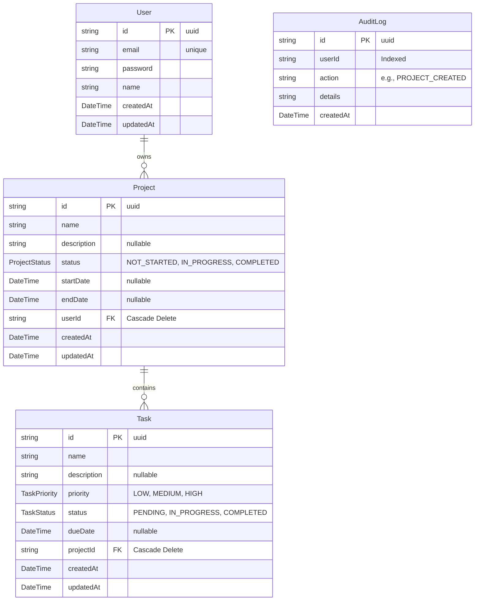

# ProManage Database Schema & ER Diagram

Below is the Entity-Relationship (ER) diagram representing the core data models and their relational flows within the ProManage platform.

## ER Diagram

## Schema Details

### 1. User
- **Description:** Represents an authenticated user in the workspace.
- **Relationships:** A user can own multiple projects (`1:N` relationship).

### 2. Project
- **Description:** Represents a workspace project containing multiple tasks.
- **Relationships:** 
  - Belongs to a single `User`.
  - Can contain multiple `Tasks` (`1:N` relationship).
  - Deleting a project cascades and deletes all associated tasks.

### 3. Task
- **Description:** Represents an actionable item within a project.
- **Relationships:**
  - Belongs to a single `Project`.
  - Contains tracked priorities (`LOW`, `MEDIUM`, `HIGH`) and statuses (`PENDING`, `IN_PROGRESS`, `COMPLETED`).

### 4. AuditLog
- **Description:** Tracks all significant mutation events across the platform (e.g., task completions, project creation).
- **Indexing:** Highly optimized with an index on `userId` to allow for rapid chronological timeline rendering on the user dashboard.
